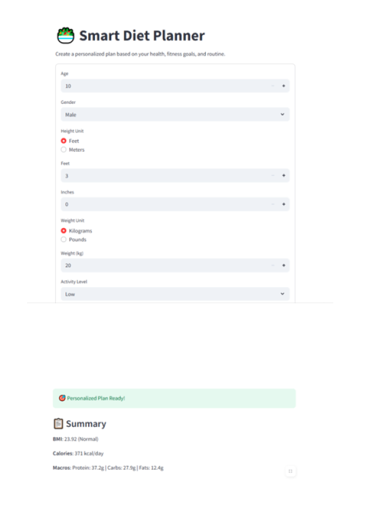
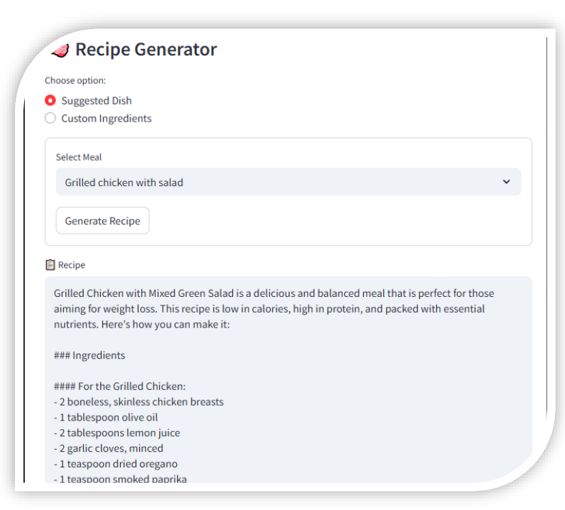
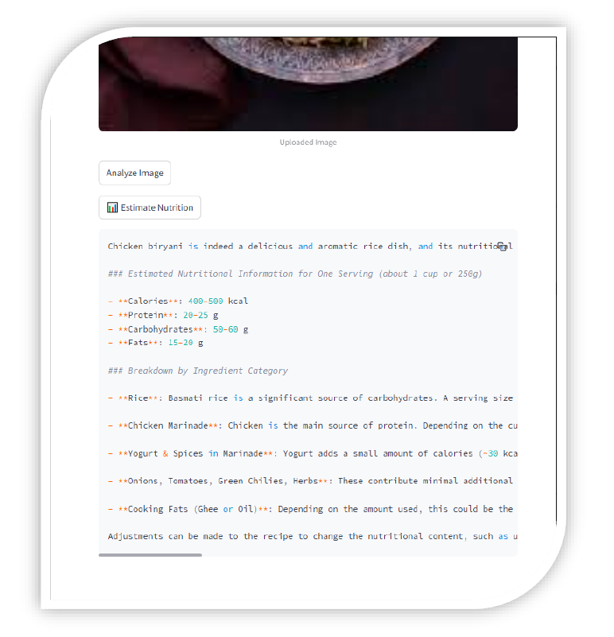

# Smart Diet Planner (MSc Project)

This AI-powered Smart Diet Planner was developed as part of my MSc in
Artficial Intelligence.

The system generates personalised diet recommendations based on
user profiles, dietary goals, and nutritional data.

## Key Features
- User profile–based diet planning
- AI-generated meal suggestions
- Nutrition data integration
- History-based recommendations

## Technology Stack
- Python
- Rule-based AI logic
- Nutrition API integration
- CSV-based user data handling

## Academic Context
This project was developed as an academic research prototype to explore
the application of AI in personalised healthcare and nutrition planning.

## 📸 Demo Screenshots

### User Signup & Navigation

### Diet Planner – User Inputs

### Personalized Diet Plan Output

### AI Recipe Generator

